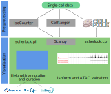

SCherlock – Detailed Single-Cell Analysis in Python
===================================================

SCherlock is a set of utilities to make the most out of your single-cell data.
It is supposed to be used in conjuntion with `anndata <https://anndata.readthedocs.io>`__ and
`scanpy <https://scanpy.readthedocs.io>`__.

The main features of SCherlock are all related to detailed qualitative and quantitative analysis
of reads - are there are changes in isoforms, promoters or enhancers? It supports a new file format,
CellPile, which enables quick pile-up generation for each clustering you perform. It can also
take output from Isocounter, a more versatile feature counter.

.. _documentation: https://scherlock.readthedocs.io
.. _contributing guide: CONTRIBUTING.md
